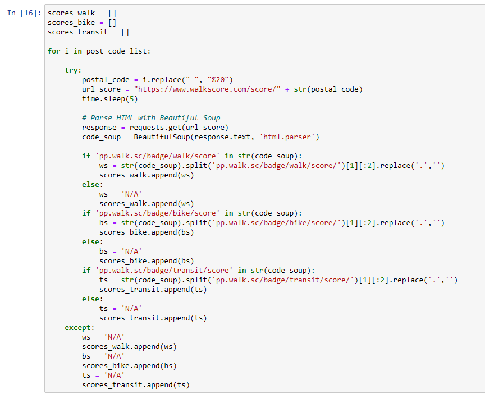
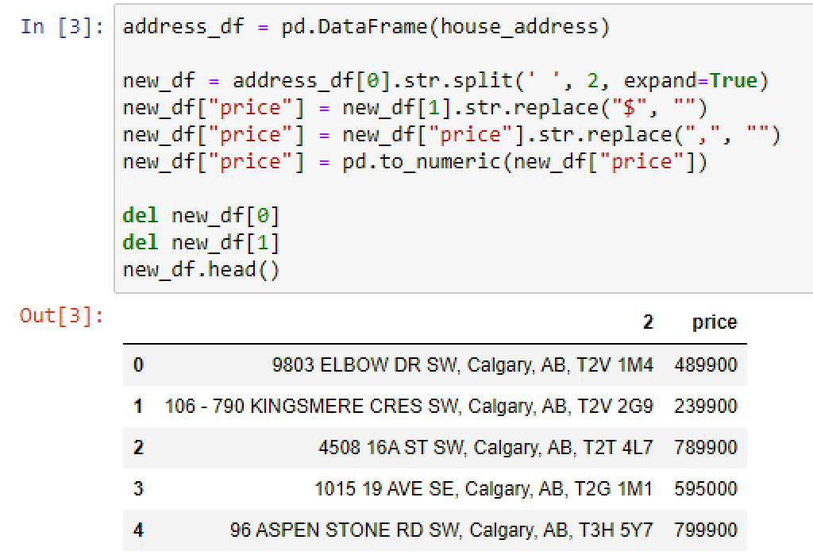
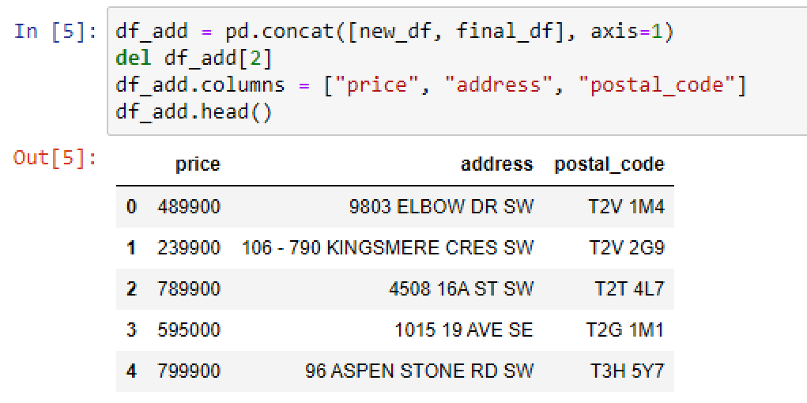
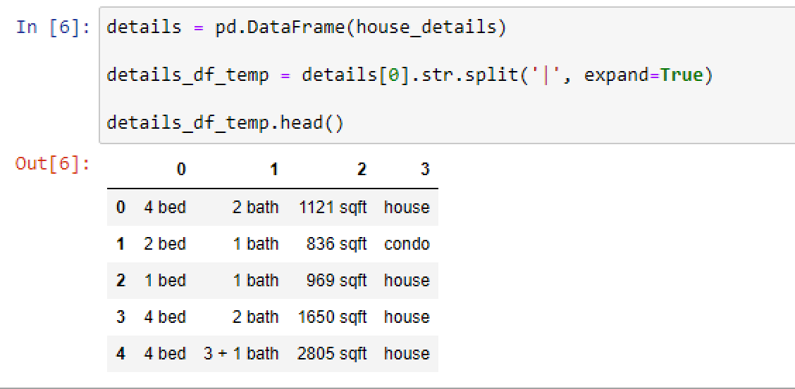
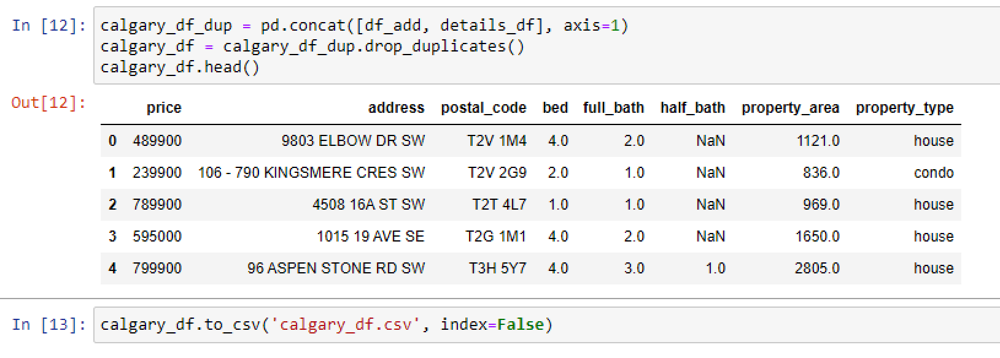
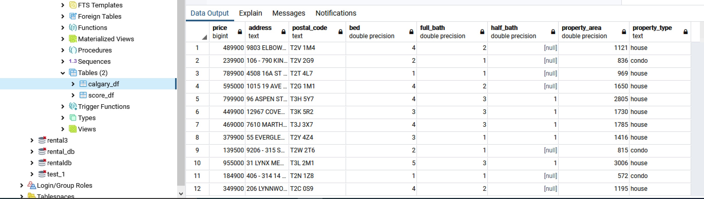

# ETL Project

# Real Estate Listings and Walk Score in Calgary

## Objective

• Extracting Real Estate listings in Calgary, Alberta
and Walk Scores for corresponding house addresses.
• Walk Score analyzes the walking routes of these
addresses to nearby amenities. Points are awarded
based on the distance to amenities in each
category.
• Transforming retrieved data into easy-to-read tables
• Loading transformed data into relational and nonrelational
databases for optimal functionality

## Data Sources

• Remax Canada: https://www.remax.ca/ab/calgary-real-estate

• Walk Score: https://www.walkscore.com/CA-AB/Calgary

# Extract

## Scraping Calgary Real Estate Data

Using BeautifulSoup to scrape property details (house address, house details).

## Scraping Walk Score Data

Using the corresponding addresses from the Calgary real estate data

# Transform

## Cleaning the Calgary Real Estate Data

#### First data frame: Address and Price details

• Values separated into columns: price, address, postal code,
• Price column type changed to integer

#### Second data frame: House details
• Values separated into columns: bedrooms, bath, property type

#### Joining the Calgary Real Estate Data frames
• Concatenating House Address/Price details and
House details data frames.

## Cleaning the Walk Score Data
• Data converted into data frame and columns
named.

# Load

## Loading to Relational Database

### PostgreSQL

Creating connection and loading data to realestate_db

#### Loaded Data

## Loading to Non-relational Database

### MongoDB

Creating connection and loading data to realestate_db

#### Loaded Data

## Converting to a Web-based Application

